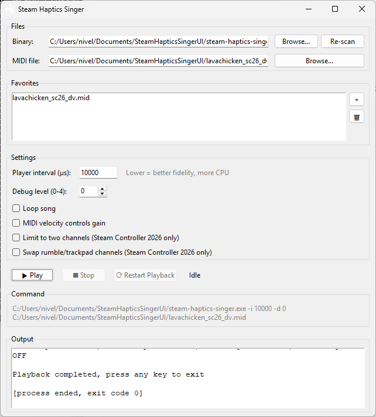

# SteamHapticsSingerUI


A simple graphical user interface for **Steam Haptics Singer** by **CrazyCritic89**.

<p align="center">
  
</p>

> This project is not affiliated with or endorsed by **CrazyCritic89** or the **Steam Haptics Singer** project.

Available for both Windows and Linux.

## Features

- ⭐ Favorites list for quick access to your songs
- ⚙️ Easily adjust Steam Haptics Singer command-line parameters
- ▶️ Play songs
- ⏹️ Stop playback
- 🔄 Restart playback

## Usage

### Linux

1. Download the latest Linux release bundled with Steam Haptics Singer.

2. Extract the contents of the folder.

3. Make steam-haptics-singer-ui executable

```bash
chmod +x steam-haptics-singer-ui
```

4. Run the application:

```bash
./steam-haptics-singer-ui
```

### Windows

1. Download the latest Windows release bundled with Steam Haptics Singer.

2. Extract the contents of the folder.

3. Run steam-haptics-singer-ui.exe

> Warning: If Windows shows you a warning saying "Windows protected your PC", click **More info** and then **Run anyway**.
> This is not malware, I just don't want to pay Microsoft 200€ a year.

## Building from Source

> This is only necessary if you want to build the application yourself.
> Do note that you will need to download Steam Haptics Singer yourself.

### 1. Clone the repository

```bash
git clone https://github.com/FryDaDog/SteamHapticsSingerUI.git
cd SteamHapticsSingerUI
```

### 2. Install Python

Download and install Python 3.10 or newer.

- **Linux:** Install it using your package manager.
- **Windows:** Download it from https://www.python.org/downloads/ and make sure to check **"Add Python to PATH"** during installation.


### 3. Install Tkinter

**Arch Linux**

```bash
sudo pacman -S tk
```

**Debian / Ubuntu**

```bash
sudo apt install python3-tk
```

**Windows**

Python's official Windows installer includes Tkinter.


### 4. Build

On Linux:

```bash
sh build-linux.sh
```

On Windows:

```bash
.\build-windows.bat
```

## Planning to add

- Installation script
- Autoupdates
- Online MIDI downloader
  
## License

SteamHapticsSingerUI is licensed under the MIT License.

Steam Haptics Singer is licensed under the BSD 3-Clause License.
